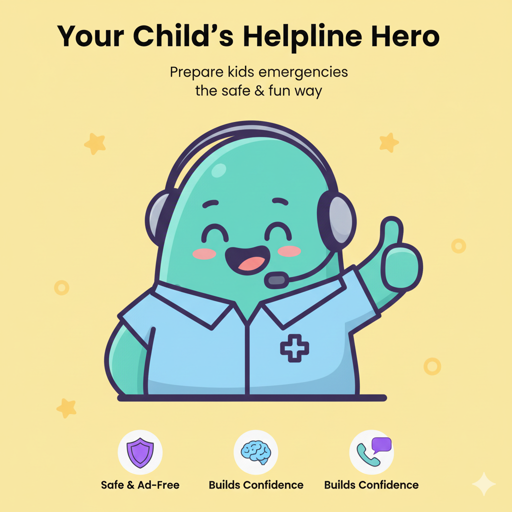

# 

> 🚨 **Empowering children with the confidence to handle emergencies**  
> Practice makes perfect. Give your child the skills that could save a life.

## 🌟 What is Bobby?

Bobby is a revolutionary emergency training platform designed specifically for children. Through interactive, age-appropriate scenarios, kids learn how to communicate effectively with emergency services—building critical skills in a safe, controlled environment.

**The question every parent asks:** *"What would my child do if something bad happened and I wasn't nearby?"*

Bobby provides the answer through practice, preparation, and confidence-building.

## ✨ Key Features

### 🎯 **Real-World Scenarios**
- Age-appropriate emergency situations (ages 4-13)
- Interactive voice-based conversations
- Real-time feedback and guidance
- Progressive difficulty levels

### 🔒 **Safe & Secure**
- **No recordings stored** – complete privacy protection
- Practice-only environment (no real emergency calls)
- Parental supervision and controls
- GDPR and COPPA compliant

### 📱 **Modern & Accessible**
- Beautiful, child-friendly interface
- Multi-language support
- Mobile-optimized experience
- Accessibility features for all children

### 🏆 **Builds Confidence**
- Achievement system and positive reinforcement
- Step-by-step guidance through each scenario
- Skills tracking for parents
- Repeat practice until mastery

## 🚀 How It Works

1. **Choose Your Scenario** – Select from various emergency situations
2. **Start the Conversation** – Speak naturally with our AI-powered emergency responder
3. **Learn & Practice** – Receive real-time guidance on what to say
4. **Review & Improve** – Track progress and build confidence over time

## 🛠️ Technology Stack

Built with modern, scalable technologies:

- **Frontend**: Next.js 16, React 19, TypeScript
- **Backend**: Firebase (Authentication, Firestore), Stripe
- **Real-time Communication**: Deepgram voice processing
- **Styling**: Tailwind CSS, shadcn/ui components
- **Testing**: Vitest, Playwright (100% test coverage)
- **Deployment**: Vercel-ready

## 📦 Getting Started

### Prerequisites

- Node.js 18+
- pnpm (recommended) or npm
- Firebase project setup

### Installation

```bash
# Clone the repository
git clone https://github.com/yourusername/bobby.git
cd bobby

# Install dependencies
pnpm install

# Set up environment variables
cp .env.example .env.local
# Edit .env.local with your Firebase and Stripe keys

# Start the development server
pnpm dev
```

Open [http://localhost:3000](http://localhost:3000) to start exploring.

### Environment Variables

```env
# Firebase
NEXT_PUBLIC_FIREBASE_API_KEY=
NEXT_PUBLIC_FIREBASE_AUTH_DOMAIN=
NEXT_PUBLIC_FIREBASE_PROJECT_ID=
NEXT_PUBLIC_FIREBASE_STORAGE_BUCKET=
NEXT_PUBLIC_FIREBASE_MESSAGING_SENDER_ID=
NEXT_PUBLIC_FIREBASE_APP_ID=
FIREBASE_PRIVATE_KEY=
FIREBASE_CLIENT_EMAIL=

# Stripe
STRIPE_SECRET_KEY=
NEXT_PUBLIC_STRIPE_PUBLISHABLE_KEY=
STRIPE_WEBHOOK_SECRET=

# Additional services
DEEPGRAM_API_KEY=
UPSTASH_REDIS_REST_URL=
UPSTASH_REDIS_REST_TOKEN=
```

## 📚 Project Structure

```
bobby/
├── app/                 # Next.js app router
├── components/          # Reusable React components
├── lib/                 # Utility functions and configurations
├── __tests__/           # Test suites (unit, integration, e2e)
├── public/              # Static assets
└── messages/            # Internationalization files
```

## 🤝 Support

- 📧 Email: contact@readywithbobby.online
- 🐛 Bug Reports: [GitHub Issues](https://github.com/yourusername/bobby/issues)

## 🙏 Acknowledgments

- Emergency services professionals who provided expert guidance
- Parents and children who participated in user testing
- The open-source community for amazing tools and libraries

---

**⚠️ Important**: Bobby is a training tool and should be used as a supplement to, not a replacement for, proper emergency education. In case of a real emergency, always dial your local emergency number.

<div align="center">

**Made with ❤️ for children everywhere**

[](http://readywithbobby.online/)

</div>
